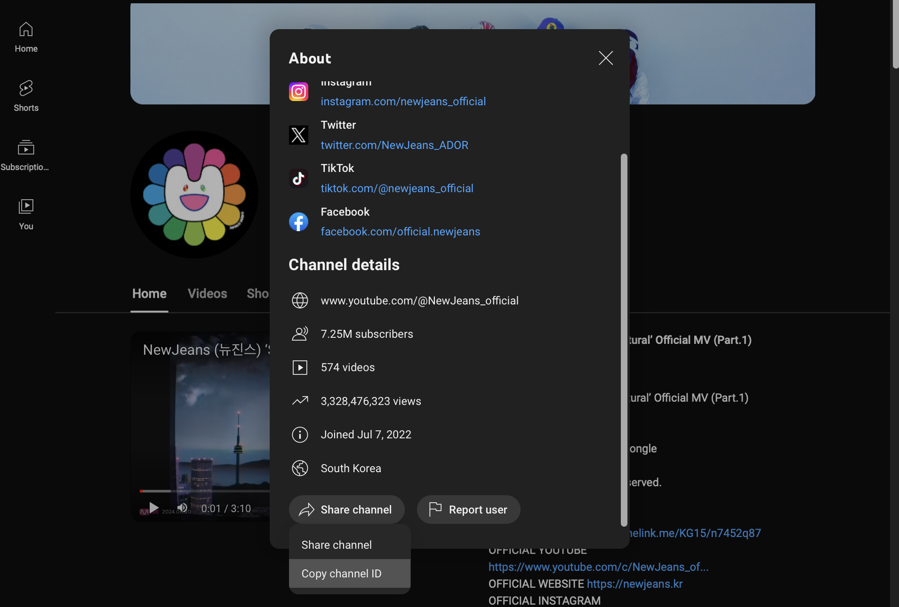

# YouTube Channel Analytics

A web application to analyze YouTube channel statistics and visualize them using bar charts.

## Features

- Fetches and displays statistics of a YouTube channel.
- Visualises video statistics using plots.
- Exports all video data to CSV files (under development).

## Prerequisites

- Python 3.x
- A Google API key with access to the YouTube Data API v3.

## Getting Started

1. **Clone the Repository**:

    ```bash
    git clone <repository_url>
    cd youtube-channel-statistics
    ```

2. **Create and Activate Virtual Environment**:

    ```bash
    python3 -m venv venv
    source venv/bin/activate  # On Windows use `venv\Scripts\activate`
    ```

3. **Install Dependencies**:

    ```bash
    pip3 install -r requirements.txt
    ```

4. **Set Up Environment Variables**:

    Create a `.env` file in the project root and add your API key:

    ```bash
    echo YOUTUBE_API_KEY=your_api_key_here > .env
    ```

5. **Run the Application**:

    ```bash
    flask run
    ```

6. **Access the Application**:

    Open your web browser and go to `http://127.0.0.1:5000`.

## Project Structure

- `app/`: Contains the main application code.
  - `routes.py`: Defines the application routes.
  - `utils.py`: Contains utility functions for fetching, processing and visualising data.
  - `templates/`: Contains HTML templates for rendering the web pages.
  - `static/`: Contains static files such as CSS and plots
  
- `requirements.txt`: Lists the Python dependencies.
- `.env`: Environment variables file (not included in the repository, need to create manually).

## Usage

- Enter a YouTube channel ID in the input field on the home page and submit.
- View the channel statistics and plots on the dashboard.

## Additional - How to get youtube channel ID





